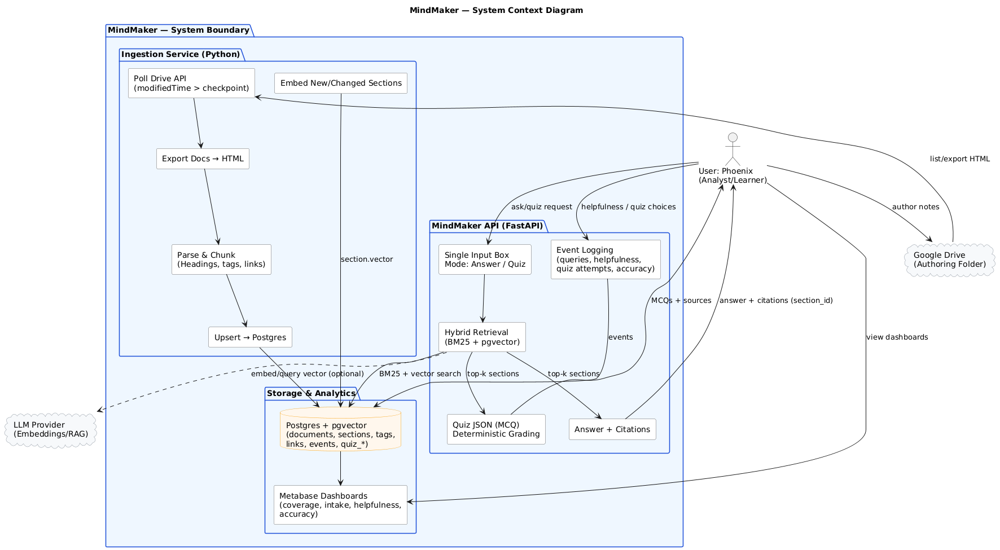

# MindMaker — Project Charter
## Context Diagram

*Open the scalable version:* [View SVG](diagrams/export/01-context.svg)

## 1) Project Name & Overview
MindMaker — Knowledge Analytics for Unstructured Docs

*Transforms Google Docs into a queryable knowledge warehouse with traceable answers and quiz validation, plus Metabase learning analytics.*
## 2) Problem Statement (Business & Personal)
Organizations and individuals accumulate large volumes of unstructured notes (Docs/Sheets).
This content is hard to search, lacks traceability, and cannot be measured for coverage or learning effectiveness.
Analysts need structured data, citations, and metrics to turn knowledge sprawl into decisions.
## 3) Purpose & Value
**Career value:** Demonstrate the full analytics lifecycle on messy data: ingest → model (ERD) → SQL → dashboards → insights with a crisp case study.

**Business value:** A minimal “knowledge ops” platform that converts unstructured documentation into a relational, analyzable system with RAG Q&A and training/quiz compliance metrics.
## 4) Objectives (SMART)
By Dec 31, 2025, deliver:
- MVP ingestion from a Drive folder; parse → chunk → store in Postgres with pgvector.
- Hybrid retrieval (BM25 + vector) powering a single input with Answer/Quiz toggle, citations required.
- Metabase dashboards for intake, coverage, retrieval helpfulness, and quiz adherence/accuracy.
- A flagship case study (ERD, SQL, dashboards, demo) suitable for interviews.

Interim milestones:
- Oct 31, 2025: MVP ingestion + retrieval + basic dashboards.
- Nov 30, 2025: Unified Answer/Quiz flow with JSON-valid MCQs, event logging, screenshots.
- Dec 31, 2025: Final case study, repo, video walkthrough.
## 5) Scope
In scope (MVP):
- Google Docs ingestion (HTML export), hierarchical chunking, tags parsing.
- Postgres schema (documents, sections, tags, links, events, quiz_*), pgvector embeddings, full-text index.
- Single UI box with mode toggle: Answer (with citations) / Quiz me (JSON schema, deterministic grading).
- Metabase dashboards for learning analytics and system KPIs.
- Case study assets (ERD, SQL examples, dashboards, write-up).

Out of scope (MVP, may note as future):
- Multi-user auth/teams, mobile app, complex spaced-repetition engine, automatic graph layouts, cross-tenant security, third-party LLM “agents”.
## 6) Success Metrics (Definition of Done)
- Ingestion Quality: ≥95% of headings/paragraphs correctly chunked; no duplicate sections on re-ingest.
- Traceability: 100% of answers and quiz items include section_id citations.
- Retrieval Helpfulness: ≥70% “helpful” feedback on evaluated queries (events payload).
- Dashboard Coverage: Domains coverage report and weekly intake trend visible in Metabase.
- Portfolio Readiness: Public repo (sanitized), ERD image, 5–8 SQL insight queries, 3 dashboard screenshots, 2–3 min demo video.
## 7) Stakeholders & Roles
- Project Owner / Analyst / Engineer: Phoenix (requirements, data modeling, SQL, dashboards, case study).
- End User: Phoenix (and future learners).
- Reviewer (optional): Mentor/peer for UX and data integrity checks.
## 8) Assumptions & Constraints
- Authoring is only Google Docs in a designated folder using heading styles; optional [tags: …] line.
- Stack: Postgres + pgvector, Metabase, FastAPI, Python ingestion, local server.
- Cost minimized (open-source); optional embedding/API costs capped with batch jobs.
## 9) Risks & Mitigations
- Embedding/API cost drift → local batching; small model; limit re-embeddings.
- Schema drift from changing parsing rules → versioned chunker; Changelog + test docs.
- Messy Docs (inconsistent headings) → charter enforces formatting guidance; ingestion warnings dashboard.
- Over-scope → strict MVP and two-sprint schedule.
## 10) Governance & Change Control
- Changelog.md for scope changes (e.g., merged Answer/Quiz flow).
- Versioning: v0.1 Ingestion, v0.2 Retrieval, v1.0 Portfolio Release.
- Review gates: End of each milestone → screenshots + metrics captured.
## 11) High-Level Timeline
- Sprint A (Oct): DB + ingestion + retrieval; seed 5–10 Docs.
- Sprint B (Nov): Answer/Quiz toggle + JSON validation + dashboards.
- Polish (Dec): Case study, repo, video.
## 12) Budget & Resources
- Budget: Minimal (open-source).
- Resources: Server PC, Postgres/pgvector, Metabase, Python/FastAPI, Google Drive API.
